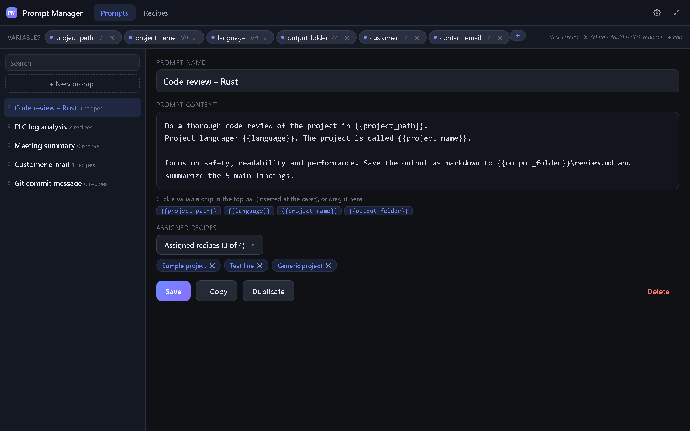
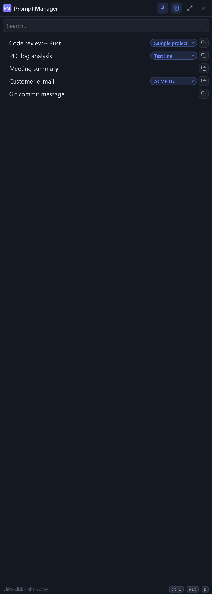

# Prompt Manager

A Windows app for managing reusable text prompts: a compact **sidebar** docked to the left edge of the screen (~15 % of its width, always on top) for quick copying, a **full manager window** for editing prompts and recipes, a **floating launcher button**, a **local REST API**, and an **MCP server** so LLM tools (Claude Code, Claude Desktop, …) can use your prompt library too.

Built with **Tauri v2** (Rust + WebView2). The core, the REST API and the MCP server have **zero external dependencies** (pure Rust std) and are fully covered by tests; the frontend is plain HTML/JS with no build step. The UI is available in **English** (default), **Czech** and **German** — switchable in Settings.

## How it looks

### Manager window

Edit prompts, insert `{{variables}}` with one click, and assign recipes:



### Sidebar

One row per prompt: pick a recipe in the badge, hit the copy button, paste anywhere. Shift+click chains several prompts into one clipboard paste:



### Floating launcher

A small always-on-top pill. Click it to open the sidebar; press-and-drag to move it anywhere (the position is remembered). It hides automatically while the sidebar is in front:


## Download

Ready-made builds are on the [Releases](../../releases/latest) page:

- `Prompt Manager_<version>_x64-setup.exe` — installer (recommended)
- `PromptManager-portable.exe` — standalone .exe, no installation

Requires Windows 10/11 with the WebView2 runtime (Windows 11 ships it; the installer downloads it if needed).

## Concepts

- **Prompt** — a name + content with `{{variable_name}}` placeholders + assigned recipes.
- **Recipe** — a named set of variable values (`name → value`). Managed centrally in the *Recipes* section and assignable to any number of prompts.
- **Variables** — a derived set: the union of variables across all recipes. The chip bar at the top fills itself; clicking a chip inserts `{{name}}` at the caret in the prompt editor (in the Recipes section it jumps to the matching value field), dragging does the same at the drop position.
- **Copying** — in the sidebar every prompt has a recipe picker; the copy button copies the text filled in with the selected recipe (or raw). **Shift+click** on copy appends the prompt after the previous one — hold Shift and click through several prompts to build one combined clipboard paste.

## Repository layout

```
pm-core/     core: models, file storage, render engine (0 dependencies, 34+ tests)
pm-api/      local REST API, hand-written HTTP server on 127.0.0.1 (0 dependencies, tests)
pm-mcp/      MCP server (stdio, JSON-RPC 2.0) -> prompt-manager-mcp binary (0 dependencies, tests)
src-tauri/   Tauri app: windows, tray, shortcut, clipboard, watcher, commands
dist/        frontend (a single index.html, no build step; runs in a browser with a mock backend)
docs/        screenshots for this README
.github/     CI: tests + Windows build (portable .exe + NSIS installer)
```

## Building on Windows

Prerequisites: [Rust](https://rustup.rs), Node.js (only for `@tauri-apps/cli`), the WebView2 runtime (Windows 11 already has it).

```powershell
npm install -g @tauri-apps/cli

# core tests
cargo test -p pm-core -p pm-api -p pm-mcp

# MCP sidecar (Tauri bundles it with the app)
cargo build -p pm-mcp --release
mkdir src-tauri/binaries -Force
copy target/release/prompt-manager-mcp.exe src-tauri/binaries/prompt-manager-mcp-x86_64-pc-windows-msvc.exe

# development (live window)
cd src-tauri
tauri dev

# release build -> portable exe + NSIS installer
tauri build
# results: src-tauri/target/release/prompt-manager.exe (portable)
#          src-tauri/target/release/bundle/nsis/*.exe (installer)
```

CI (`.github/workflows/build.yml`) does the same automatically — push the repository to GitHub and grab the artifacts from Actions (or push a `v*` tag for a release).

## Storage (portable)

Default location `%APPDATA%/PromptManager/library/` (changeable in Settings — put it on OneDrive etc. if you like):

```
library/
├── prompts/*.md        1 prompt = 1 file (YAML frontmatter + content)
├── recipes/*.yaml      1 recipe = 1 file
└── order.json          prompt ordering
```

Copy the folder to move everything to another machine. The app watches the folder (polling ~1.5 s), so outside changes show up automatically.

## REST API

`http://127.0.0.1:8737/api/v1/` (port in Settings), header `Authorization: Bearer <api_key>` — the key is shown in Settings. Endpoints: `GET/POST /prompts`, `GET/PUT/DELETE /prompts/{id}`, `PUT /prompts/order`, `POST /prompts/{id}/render` (`{"recipe_id": "...", "overrides": {...}}` → `{"text": "...", "missing": [...]}`), `GET/POST /recipes`, `GET/PUT/DELETE /recipes/{id}`, `GET /variables`.

## MCP server (Claude Code / Claude Desktop)

The `prompt-manager-mcp.exe` binary (stdio). Copy the config snippet from the app's Settings, or write it by hand:

```json
{
  "mcpServers": {
    "prompt-manager": {
      "command": "C:\\path\\to\\prompt-manager-mcp.exe",
      "args": ["--library", "C:\\Users\\...\\AppData\\Roaming\\PromptManager\\library"]
    }
  }
}
```

Tools: `list_prompts`, `get_prompt`, `render_prompt(id|name, recipe?)`, `create_prompt`, `update_prompt`, `delete_prompt`, `list_recipes`, `get_recipe`, `create_recipe`, `update_recipe`, `list_variables`. Prompts and recipes can be addressed by name.

## Controls

- Tray icon: left click = show/hide the sidebar, right click = menu.
- Global shortcut `Ctrl+Alt+P` (change it in Settings, applied after restart).
- Sidebar: ⋮⋮ grip = drag to reorder; the badge next to the name = recipe used for copying; ↗ icon = full manager window; ⊙ icon = show/hide the floating launcher.
- Floating launcher (above all windows): click = open the sidebar; drag to move it anywhere (the position is remembered). It hides while the sidebar is in front, and clicking it while the sidebar is buried under another window brings the sidebar forward.
- Closing a window does not quit the app (it lives in the tray); Quit is in the tray menu.

## Known limitations (candidates for future versions)

- Changing the API port / shortcut / library folder takes effect after an app restart.
- The content editor is a plain textarea (placeholders are highlighted below it, not inline).
- Export/import of a prompt selection is done by copying the `library/` folder.
- No light theme yet.
- Windows: the first run may require installing the WebView2 runtime (the installer handles it).

## License

MIT
